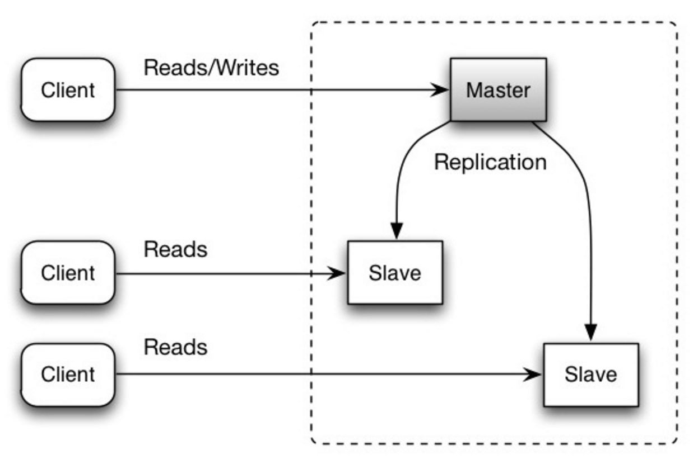
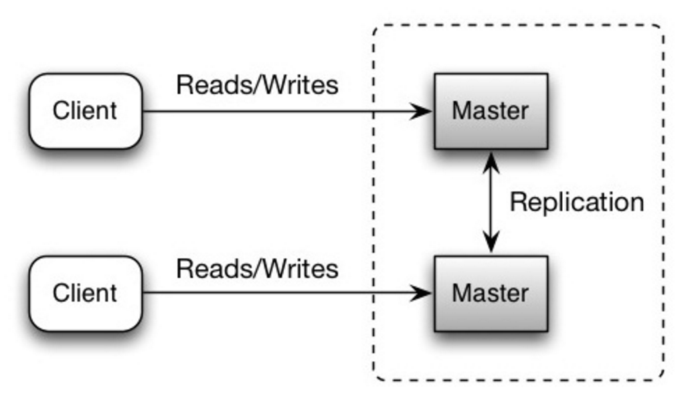

# 分布式系统

分布式系统是把一个系统的计算和数据拆分到多台通过网络连接的机器上，让它们协同对外提供服务，并对使用者表现得像一个整体。它的核心特征是：由多个节点组成、节点之间只能通过网络通信、没有共享内存、且每个节点都可能独立发生故障。

引入分布式的根本原因是单机在容量、性能和可用性上都存在物理上限，需要用多机协作来突破。它主要解决三类问题：一是**扩展性**，当单机存不下或算不动时，通过分片和负载均衡横向扩容；二是**高可用**，单机故障会导致整体不可用，多节点冗余与副本可以让部分节点宕机时系统仍能继续服务；三是**性能与就近访问**，数据和计算分散在多个节点上，能够就近访问、并行处理，从而降低延迟、提升吞吐。

这些收益并非没有代价。一旦系统跨网络、由多个节点组成，就必然引入单机不存在的新问题：网络不可靠（存在延迟、丢包和分区）、数据一致性难以保证、节点的部分故障难以判断，以及缺乏统一的全局时钟。因此，学习分布式系统的主线，是围绕**如何在不可靠的网络和会发生故障的节点之上保证正确性与可用性**展开的，后续的 CAP 理论、一致性协议、分布式事务等主题都由此引出。

## 1. 可用性与一致性

### 1.1 CAP 理论

在一个分布式计算系统中，只能同时满足下列三点中的两点：

| 属性 | 含义 |
| --- | --- |
| 一致性（Consistency） | 每次访问都能获得最新数据，但可能会收到错误响应 |
| 可用性（Availability） | 每次访问都能收到非错误响应，但不保证获取到最新数据 |
| 分区容错性（Partition tolerance） | 在任意分区网络故障的情况下系统仍能继续运行 |

网络并不可靠，所以必须支持分区容错性，并在可用性和一致性之间做出取舍。取舍后得到两种系统：

- **CP（一致性与分区容错性）**：等待分区节点的响应可能会导致延时错误。如果业务需求需要原子读写，CP 是一个不错的选择。
- **AP（可用性与分区容错性）**：响应节点上可用数据的最近版本，可能并不是最新的；当分区解析完成后，写入操作可能需要一些时间来传播。如果业务需求允许最终一致性，或要求系统在出现外部故障时仍继续运行，AP 是一个不错的选择。

选择 AP 之后如何运转，由 BASE 理论给出落地思路。BASE 是 **Basically Available（基本可用）、Soft state（软状态）、Eventually consistent（最终一致）** 的缩写，核心思想是即使无法做到强一致，也可以根据业务特点采用适当方式，让系统达到最终一致。它与追求强一致的 ACID 相反，是对 CAP 中 AP 方案的补充与延伸。

| 组成 | 含义 |
| --- | --- |
| 基本可用 | 系统出现故障时，允许损失部分可用性（如降级、排队、限流），但保证核心功能可用 |
| 软状态 | 允许数据存在中间状态，即副本之间同步存在延迟，且不影响系统整体可用 |
| 最终一致 | 不要求时刻强一致，但保证经过一段时间后所有副本最终达到一致 |

### 1.2 一致性模式

同一份数据存在多份副本时，需要在如何同步它们之间做出选择，以便让客户端看到一致的数据。这里对应 CAP 中的一致性定义——每次访问都能获得最新数据，但可能会收到错误响应。

| 模式 | 行为 | 复制方式 | 典型场景 |
| --- | --- | --- | --- |
| 弱一致性 | 写入之后，访问可能看到、也可能看不到写入数据，尽力优化使其能访问最新数据 | —— | memcached；VoIP、视频聊天、实时多人游戏 |
| 最终一致性 | 写入之后，访问最终能看到写入数据（通常在数毫秒内） | 异步复制 | DNS、email 等高可用性系统 |
| 强一致性 | 写入之后，访问立即可见 | 同步复制 | 文件系统、关系型数据库（RDBMS） |

弱一致性以实时性优先：例如通话中丢失信号几秒，重新连接时听不到这几秒的内容。最终一致性在高可用性系统中表现良好；强一致性适合需要可靠记录的系统。

### 1.3 可用性模式

支持高可用性有两种模式：故障切换（fail-over）和复制（replication）。

**故障切换**

- **工作到备用切换（Active-passive）**：工作服务器周期性地向待机的备用服务器发送信号；如果信号中断，备用服务器切换成工作服务器的 IP 地址并恢复服务。宕机时间取决于备用服务器处于“热”待机状态，还是需要从“冷”待机状态启动。只有工作服务器处理流量。这种方式也称为主从切换。
- **双工作切换（Active-active）**：双方都管控流量，在它们之间分散负载。如果是外网服务器，DNS 需要对双方都了解；如果是内网服务器，应用程序逻辑需要对双方都了解。这种方式也称为主主切换。

故障切换的缺陷：需要添加额外硬件并增加复杂性；如果新写入的数据在被复制到备用系统之前工作系统出现故障，则有可能丢失数据。

**复制** 复制让多台库持有同一份数据的副本，区别在于谁能写，主要分为主从复制和主主复制两种方式。

**主从复制（Master-slave）**：一个主库负责读和写，一个或多个从库从主库复制数据、只对外提供读；从库下面还可以再挂从库形成树状结构。写只走主库，读可以分摊到多个从库，适合读多写少的场景。主库宕机时系统仍可通过从库继续只读运行，要恢复写能力需要把某个从库提升为新主库。缺陷是提升主库需要额外处理逻辑，且复制通常异步，主库在数据复制到从库之前宕机可能丢失这部分写入。



**主主复制（Master-master）**：两个或多个主库都能读也能写，彼此之间互相同步数据。一个主库宕机时，另一个主库仍能同时提供读和写，可用性更强。缺陷是需要负载均衡器或改动应用逻辑来决定写请求落到哪个主库；多主同时可写通常只能做到最终一致，或为保持一致而牺牲写入延迟；写节点越多，同步延迟越大，写冲突的处理越关键。



| 维度 | 主从复制 | 主主复制 |
| --- | --- | --- |
| 谁能写 | 只有主库 | 多个主库都能写 |
| 读扩展 | 从库分摊读 | 各主库都可读 |
| 主库故障 | 降级为只读，需提升从库 | 另一主库继续读写 |
| 主要难点 | 提升主库、异步复制丢数据 | 写路由、写冲突、一致性 |

无论主从还是主主，复制都有共同代价：主库在复制完成前故障可能丢数据；写越多，从库复制负担越重、复制越慢；副本越多，复制延迟越大。

## 2. 共识算法：Raft

Raft 是现代分布式系统中最常用的共识算法，ZooKeeper（ZAB）、etcd、Consul、TiKV 等强一致组件都基于它或其变体实现。

### 2.1 Raft 解决什么问题

多个节点各存一份数据副本，在网络会延迟丢包、节点会宕机的前提下，如何让它们对一系列操作的顺序达成一致，始终表现得像一台可靠的机器，这就是共识（Consensus）。

Raft 的设计目标是可理解，它把共识拆成三个相对独立的子问题：Leader 选举、日志复制和安全性。定位上 Raft 是强一致（CP）：牺牲分区期间的部分可用性，换取数据正确。

### 2.2 角色与任期

| 角色 | 职责 |
| --- | --- |
| Leader（领导者） | 唯一处理客户端请求的节点，负责接收写入并复制给其他节点 |
| Follower（跟随者） | 被动接收 Leader 的日志和心跳，不主动发起请求 |
| Candidate（候选者） | 选举期间的临时状态，用于竞选 Leader |

任期（Term）指 Raft 把时间切成的一个个阶段，每个任期以一次选举开始。任期号单调递增，充当逻辑时钟：节点间通信时带上任期号，任期旧的一方服从新的一方，以此识别过期的 Leader。任何时刻最多存在一个 Leader。

### 2.3 Leader 选举

- 正常时，Leader 周期性地向所有 Follower 发送心跳（内容为空的日志复制消息）以维持地位。
- 每个 Follower 有一个随机的选举超时（如 150~300 毫秒）。在超时内没有收到心跳，就认为 Leader 已失效，于是自增任期、转为 Candidate，先给自己投一票，再向其他节点拉票。
- 获得多数派（quorum）选票的 Candidate 当选为新的 Leader。
- 随机超时是关键设计：让各节点的超时时间错开，避免同时发起选举导致选票被瓜分（split vote），从而快速选出唯一 Leader。

### 2.4 日志复制

写请求只走 Leader，由 Leader 统一决定顺序，再复制给其他节点：

```text
客户端写请求 → Leader
    Leader 追加到自己的日志（uncommitted）
    Leader 并行把该日志复制给所有 Follower
    收到多数派确认后 → Leader 将该日志标记为 committed 并应用到状态机
    Leader 返回客户端成功，并在后续心跳中通知 Follower 提交
```

- 每条日志带有 index 和 term，写入只走 Leader，保证单一顺序。
- 提交条件是多数派：例如 5 节点集群，写入被 3 个节点持久化即算提交，不需要全部节点，因此少数节点宕机不影响写入。
- Leader 通过一致性检查强制 Follower 的日志与自己对齐，不一致就回退并覆盖，保证所有节点日志最终相同。

### 2.5 安全性

Raft 依靠一条选举限制保证正确性：只有日志足够新（最后一条日志的 term 与 index 不落后于多数派）的 Candidate 才能当选。这样保证新 Leader 一定包含所有已提交的日志，不会丢失已提交的数据。

### 2.6 脑裂与多数派

网络分区可能出现两个“Leader”，但 Raft 用多数派加任期化解：

- 被隔离在少数派分区的旧 Leader，无法凑齐多数派确认，写入无法提交，实际上处于瘫痪状态。
- 多数派分区会选出任期更高的新 Leader 正常服务。
- 分区恢复后，旧 Leader 发现更高的任期，自动退回 Follower 并回滚未提交的日志。
- 这也解释了为什么 Raft 集群通常采用奇数节点（3、5）：便于形成多数派，且容错能力（3 容 1、5 容 2）的性价比最高。

### 面试问答

**Q：Raft 是如何保证多个节点数据一致的？**

Raft 是一种强一致的共识算法，把共识拆成 Leader 选举、日志复制和安全性三部分以便理解。集群有 Leader、Follower、Candidate 三种角色，用单调递增的任期号充当逻辑时钟。正常时 Leader 靠心跳维持地位；Follower 在随机选举超时内没收到心跳就发起选举，拿到多数派选票即当选，随机超时用来避免选票瓜分。写请求只走 Leader，Leader 把日志复制给多数派并确认后才提交并应用，所以少数节点宕机不影响写入。安全性靠“只有日志够新的节点才能当选”保证不丢已提交数据；网络分区时少数派的旧 Leader 无法提交而瘫痪，多数派选出新 Leader，恢复后旧 Leader 退位，因此集群一般采用奇数节点。

## 3. 分布式事务

单机事务依靠数据库的 ACID 保证一组操作要么全部成功、要么全部回滚。但当一个业务操作跨越多个数据库或多个服务时（如下单要扣库存、扣余额、加积分，分属不同库或服务），单机事务无法覆盖多个节点，就需要分布式事务：在多个独立节点上保证这组操作的结果整体一致，要么都生效，要么都不生效。

其根本难点仍回到 CAP：跨网络的多节点无法既强一致又高可用，因此各种方案本质是在强一致和最终一致之间做不同取舍。

### 3.1 两条技术路线

| 路线 | 思路 | 代表方案 |
| --- | --- | --- |
| 刚性事务（强一致） | 全程锁定资源，所有节点同时提交或回滚 | 2PC、3PC |
| 柔性事务（最终一致） | 不锁全局，允许中间不一致，靠补偿或重试最终收敛 | TCC、Saga、事务消息 |

### 3.2 2PC（两阶段提交）

2PC 引入一个协调者统一指挥，分准备和提交两个阶段：

```text
阶段一（准备）：协调者问所有参与者“能提交吗？” → 各参与者锁资源、写 undo/redo 日志，回复 Yes/No
阶段二（提交）：全部 Yes → 协调者发 Commit；有一个 No → 发 Rollback
```

- 优点：强一致，实现相对标准（XA 协议）。
- 缺点：准备到提交期间资源一直锁着，存在同步阻塞；协调者是单点；极端情况下参与者状态可能不一致。3PC 增加一个阶段和超时机制缓解阻塞，但更复杂且仍不完美。

2PC 不只用于跨库的分布式事务，它是一种通用的协调范式，MySQL 单机内部同样用到。为了保证引擎层的 redo log 和 server 层的 binlog 两份日志一致，InnoDB 提交时走内部 2PC：先写 redo log 并置为 prepare 状态（准备），再写 binlog，最后把 redo log 置为 commit（提交）。这样崩溃恢复时，依据“redo log 处于 prepare 状态、binlog 是否已写入”来决定提交还是回滚，保证两份日志不会一个有一个没有。

消息队列的事务消息也借用了这套两阶段结构。以 RocketMQ 为例：生产者先发送一条对消费者不可见的半消息（相当于准备），再执行本地事务，成功就提交半消息使其可见，失败就回滚（相当于提交或中止）；若第二阶段确认丢失，Broker 会回查本地事务状态再决定。区别在于，它不锁定资源、依靠回查兜底，本质是最终一致，属于 2PC 思想的柔性版本，而非刚性 2PC。

### 3.3 TCC（Try-Confirm-Cancel）

TCC 把每个操作拆成三个业务接口，由应用层自己实现：

- Try：预留资源（如冻结库存，而不是直接扣减）；
- Confirm：确认执行（真正扣减已冻结的部分）；
- Cancel：取消并释放预留的资源。

全部 Try 成功就 Confirm，任一失败就对已成功的部分 Cancel。优点是不长期锁数据库、性能好、可控；缺点是业务侵入强，每个操作都要实现三个接口，并保证幂等。

### 3.4 Saga

Saga 把一个长事务拆成一串本地事务，每个本地事务配一个补偿操作。正常时顺序执行 T1→T2→T3；中途失败就反向执行补偿 C3→C2→C1，抵消已完成的步骤。优点是无长期锁，适合流程长、跨服务多的业务；缺点是只保证最终一致，且补偿逻辑要业务自己设计（有的操作难以补偿，如已发出的短信）。

### 3.5 事务消息

事务消息借助消息队列达成最终一致：把业务操作和发消息放进同一个本地事务，消息可靠投递给下游，下游消费并幂等处理。优点是与消息队列天然结合、解耦、吞吐高；缺点是只保证最终一致、存在延迟。其半消息与回查机制详见[消息队列](./message-queue)一章。

### 3.6 方案对比

| 方案 | 一致性 | 是否锁资源 | 业务侵入 | 适用场景 |
| --- | --- | --- | --- | --- |
| 2PC/3PC | 强一致 | 是（阻塞） | 低 | 少节点、强一致要求、数据库支持 XA |
| TCC | 最终一致 | 否（预留） | 高 | 高性能、资源可预留（账户、库存） |
| Saga | 最终一致 | 否 | 中 | 长流程、跨多服务 |
| 事务消息 | 最终一致 | 否 | 中 | 异步解耦、可容忍延迟 |

### 面试问答

**Q：分布式事务有哪些实现方案，如何选型？**

分布式事务解决一个业务操作跨多个库或多个服务时如何保证整体一致。因为跨网络多节点无法兼顾强一致和高可用，方案分两类：刚性事务追求强一致，如 2PC，由协调者分准备和提交两阶段让所有参与者一起提交或回滚，缺点是资源阻塞和协调者单点，2PC 也用于 MySQL 内部保证 redo log 与 binlog 一致；柔性事务追求最终一致，如 TCC 把操作拆成 Try 预留、Confirm 确认、Cancel 取消三步，Saga 把长事务拆成一串带补偿的本地事务、失败就反向补偿，以及基于事务消息用消息队列保证最终一致。实践中除非有强一致硬需求，更常用柔性事务，尤其是 Saga 和事务消息。

## 4. 数据分片与一致性哈希

### 4.1 为什么需要数据分片

复制（主从、主主）解决的是读扩展和高可用，但每个节点仍要存全量数据。当数据量或写入量超过单机上限时，复制就无能为力。数据分片（Sharding、分区）的思路是把一份大数据按某种规则拆成多份、分散到多个节点，每个节点只存一部分，从而分摊存储和写入压力，实现真正的横向扩容。

分片解决写扩展和容量，复制解决读扩展和高可用，二者常结合使用：先分片，每个分片再做主从复制。数据库层面的分片落地（何时拆、垂直拆与水平拆、分片键选型、扩容路径）见 [MySQL](./mysql) 一章的分库分表，本节聚焦通用的分片策略与一致性哈希算法。

### 4.2 常见分片策略

| 策略 | 做法 | 优点 | 缺点 |
| --- | --- | --- | --- |
| 范围分片（Range） | 按 key 区间划分（如按时间、ID 段） | 范围查询高效 | 新数据易集中，形成热点 |
| 哈希分片（Hash） | 对 key 取哈希再取模决定节点 | 数据分布均匀 | 不支持范围查询；扩缩容要大规模搬数据 |
| 一致性哈希 | 哈希到一个环上，顺时针找节点 | 扩缩容只影响相邻节点 | 实现较复杂，需处理数据倾斜 |

### 4.3 普通哈希取模的问题

最朴素的哈希分片是 `节点编号 = hash(key) % N`，N 为节点数。问题出在 N 变化时：一旦增删节点，N 变了，几乎所有 key 的取模结果都会改变，导致绝大部分数据需要在节点间迁移。对缓存而言，这意味着大面积缓存同时失效，请求瞬间打穿到数据库。

### 4.4 一致性哈希

一致性哈希不对节点数取模，而是把哈希值域首尾相接成一个环（0 ~ 2³²-1），并让节点和数据都映射到同一个环上：

- 对每个节点（用 IP、主机名等）求哈希，确定它在环上的位置；
- 对每个数据 key 求哈希，确定它在环上的位置；
- 定位规则：从 key 的位置顺时针走，遇到的第一个节点就负责存储它。

```text
        0 ───────────────
       ╱                 ╲
   nodeC               nodeA
      │        环         │
      │                   │
   key ★ ── 顺时针 ──→ nodeB
       ╲                 ╱
        ─────────────────
```

它的价值在于减少迁移量。普通取模在 N 变化时几乎全量迁移；一致性哈希中环上其他节点位置不动，只有变化点附近受影响：

- 新增节点：只有“从新节点逆时针到前一个节点”这一段的 key 改由新节点接管，其余不动；
- 删除节点：只有该节点负责的那段 key 顺延到下一个节点，其余不动。

### 4.5 虚拟节点解决数据倾斜

节点数量少时，它们在环上由哈希随机决定的位置往往不均匀，可能有的节点负责很长一段、有的很短，造成负载倾斜。解决办法是给每个真实节点分配多个虚拟节点（如 nodeA → A#1、A#2 … A#100），位置由 `hash(节点标识 + 编号)` 决定，均匀撒满环；key 先定位到某个虚拟节点，再映射回对应的真实节点。

虚拟节点缓解倾斜的本质是大数定律：单个点的弧长波动很大，但一个真实节点的负载等于它上百个分身各段弧长之和，多个独立随机段求和后会向期望值收敛，分身越多，各节点的弧长总和越接近均分。此外，某个真实节点故障时，它的分身散落在环各处，负载会被均匀分摊给其余多个节点，而不是整段压给相邻的某一个。

### 面试问答

**Q：一致性哈希解决了什么问题，为什么要引入虚拟节点？**

数据分片把大数据拆分到多个节点解决单机容量和写入瓶颈。普通哈希取模的问题是节点增删时 N 变化会导致几乎所有 key 重新映射、大量数据迁移，对缓存就是大面积失效。一致性哈希把节点和数据都映射到一个环上，key 顺时针找第一个节点，增删节点只影响相邻区段，大幅减少迁移量。但节点少时在环上分布不均会造成倾斜，于是给每个真实节点分配多个虚拟节点均匀撒在环上，靠大数定律让各节点负责的弧长趋于均匀，同时节点故障时负载能分摊给多个节点而非压垮相邻的一个。

## 5. 微服务架构

### 5.1 微服务架构是什么

微服务架构是一种把单一大应用拆分成一组小型、独立服务的架构风格。每个服务具备四个特征：

- 只负责一块相对独立的业务能力（如订单、库存、用户）；
- 可以独立开发、独立部署、独立扩容；
- 拥有自己的数据库，数据私有，不和其他服务共享库；
- 服务之间只能通过网络通信协作，不能直接访问对方的内存或数据库。

它的对立面是单体架构（Monolith）：所有功能打包成一个应用、跑在一个进程里、共用一个数据库。

### 5.2 为什么要拆：单体的瓶颈

单体在业务和团队规模变大后会暴露几个问题，微服务针对性地改善：

| 单体的问题 | 微服务的改善 |
| --- | --- |
| 代码耦合，改一处要全量回归 | 服务边界清晰，改动范围可控 |
| 一处故障可能拖垮整个进程 | 故障隔离在单个服务内 |
| 任何小改动都要整体部署 | 按服务独立部署、独立发布 |
| 只能整体扩容，浪费资源 | 按服务按需扩容（如只扩订单） |
| 技术栈被整体锁死 | 各服务可选不同语言与存储 |

### 5.3 拆开之后的新问题

把应用拆开并不难，难的是拆开后必须处理的一系列分布式问题，这也是微服务归属分布式的原因：

| 新问题 | 对应方案 | 在笔记中的位置 |
| --- | --- | --- |
| 服务之间怎么调用 | 同步用 RPC（gRPC、Thrift、Dubbo），异步用消息队列 | RPC 待补，消息队列见对应章 |
| 服务怎么找到对方 | 服务注册与发现（Nacos、Consul、etcd） | 待补 |
| 请求如何分发到多个实例 | 负载均衡 | 待补（呼应一致性哈希） |
| 跨服务的数据一致性 | 分布式事务（Saga、事务消息） | 见第 3 章 |
| 某个服务故障会不会拖垮全链路 | 熔断、限流、降级 | 待补 |
| 如何排查跨服务的问题 | 链路追踪、监控 | 待补 |
| 服务边界怎么划分才合理 | DDD 限界上下文 | 见[通用基础](./general-concepts#_3-领域驱动设计-ddd)的领域驱动设计 |
| 统一入口与鉴权 | API 网关 | 待补 |

其中服务间通信是最基础的一环：RPC 让远程调用像调用本地方法一样，用于需要实时结果的同步场景；消息队列用于异步解耦。RPC 只是微服务内部通信的一种手段，不等于微服务本身。

### 5.4 微服务的代价

微服务不是任何场景都更优的选择，它有明确的成本：

- 运维复杂度显著上升：几十上百个服务的部署、配置、监控都要管理；
- 分布式问题全部显性化：网络延迟、部分失败、数据一致性都必须处理；
- 对团队和基础设施有门槛：需要成熟的 CI/CD、监控、治理体系。

因此，微服务主要解决大团队、大系统的协作与演进问题。业务简单、团队较小时，单体往往开发和运维成本都更低，不必强行拆分；服务拆分也不是越细越好，拆得过细会让调用链变长、一致性更难保证。

### 面试问答

**Q：什么是微服务架构，它带来了哪些新问题？**

微服务架构是把单体应用按业务能力拆成一组可独立开发、部署、扩容的小服务，每个服务有自己的数据库，服务间通过 RPC 或消息队列通信。它解决单体的代码耦合、整体部署、无法按需扩容等问题，代价是引入大量分布式问题：服务发现、负载均衡、跨服务事务、熔断限流、链路追踪都要额外解决。服务怎么拆通常借助 DDD 的限界上下文。微服务适合大团队大系统，业务简单时用单体反而更合适。

## 6. RPC

### 6.1 RPC 是什么

RPC（Remote Procedure Call，远程过程调用）是一种让程序像调用本地方法一样调用远程服务的通信方式。调用方写起来就是一个普通的函数调用，但方法的真正执行发生在另一台机器的进程里，网络传输、序列化等细节被框架隐藏。它的核心目标是让远程调用对开发者透明，屏蔽底层网络通信的复杂度。

### 6.2 为什么需要 RPC

服务拆开后总要互相调用，最朴素的做法是自己用 HTTP 加 JSON 手写请求。RPC 框架把这些重复劳动标准化了：

| 手写 HTTP 调用 | RPC 框架 |
| --- | --- |
| 手动拼 URL、序列化、解析响应 | 像调本地方法，框架自动处理 |
| 自己管理连接、超时、重试 | 框架内置 |
| 缺乏统一的服务发现、负载均衡 | 通常集成治理能力 |
| 文本传输，体积大、解析慢 | 多用二进制协议，更高效 |

### 6.3 RPC 的核心流程

一次 RPC 调用背后经历的步骤：

```text
调用方（Client）                         服务方（Server）
   ↓ 调用本地「桩」Stub
   ↓ ① 序列化：参数编码成字节流
   ↓ ② 网络传输：通过 TCP 发送
   ─────────────────────────────────→  ③ 接收字节流
                                        ④ 反序列化：还原成参数
                                        ⑤ 调用真正的服务实现
                                        ⑥ 序列化返回值
   ⑧ 反序列化结果  ←───────────────────  ⑦ 网络回传
   ↓ 返回给调用方
```

几个关键角色：

- **Stub（桩、代理）**：客户端本地的“假方法”，负责把调用转成网络请求，是“像本地调用”的关键；
- **序列化 / 反序列化**：对象与字节流互转，决定传输效率和跨语言能力；
- **网络传输**：通常基于 TCP，也有基于 HTTP/2 的实现（如 gRPC）。

### 6.4 关键组成

一个完整的 RPC 框架通常由以下几部分组成：

| 组成 | 作用 | 常见选择 |
| --- | --- | --- |
| 序列化协议 | 数据编解码 | Protobuf、Thrift、JSON、Hessian |
| 网络传输 | 数据收发 | TCP、HTTP/2、Netty |
| 服务发现 | 找到服务实例地址 | 注册中心（Nacos、etcd、ZooKeeper） |
| 负载均衡 | 在多个实例间分发 | 轮询、加权、一致性哈希 |
| 治理能力 | 超时、重试、熔断限流 | 框架内置 |

- **序列化协议**：负责把内存里的对象和网络上传输的字节流互相转换。它直接决定传输体积、编解码速度和跨语言能力，是 RPC 性能的关键。二进制协议（Protobuf、Thrift）比文本协议（JSON）更紧凑、更快，且能通过 IDL（接口描述文件）生成多语言代码。
- **网络传输**：负责把序列化后的字节流可靠地在两端收发。多数 RPC 基于 TCP 长连接，配合连接池复用连接以减少握手开销；gRPC 则基于 HTTP/2，利用多路复用在一条连接上并发多个请求。Netty 等网络框架常被用作底层的异步 I/O 实现。
- **服务发现**：解决“调用方如何知道服务实例的地址”。服务启动时把自己的地址注册到注册中心（Nacos、etcd、ZooKeeper），调用方从注册中心获取可用实例列表，实例上下线时列表动态更新，因此不需要把地址写死在配置里。
- **负载均衡**：在拿到多个可用实例后，决定这一次调用具体发给哪一个。常见策略有轮询、加权轮询、随机、最少连接和一致性哈希，目的是分摊压力、避免单个实例过载。它通常在客户端完成（客户端负载均衡）。
- **治理能力**：保证调用在异常情况下仍然可控，包括超时（避免无限等待）、重试（应对偶发失败，需配合幂等）、熔断（下游持续失败时快速失败，防止故障扩散）、限流（保护服务不被压垮）等，这些能力一般由框架内置或通过拦截器扩展。

### 6.5 主流框架

- **gRPC**：Google 开源，基于 HTTP/2 与 Protobuf，跨语言，社区主流；
- **Thrift**：Facebook 开源，跨语言、性能好；
- **Dubbo**：阿里开源，Java 生态，服务治理能力强；
- 各大厂还有自研的高性能框架（如 bRPC、Kitex）。

### 6.6 RPC 与 REST 的区别

| 维度 | RPC | REST（HTTP + JSON） |
| --- | --- | --- |
| 风格 | 面向方法调用 | 面向资源 |
| 传输 | 多为二进制、TCP | 文本、HTTP |
| 性能 | 高 | 相对低 |
| 跨语言、通用性 | 需框架支持 | 通用，浏览器友好 |
| 典型场景 | 内部服务间高频调用 | 对外开放 API |

### 面试问答

**Q：RPC 的调用过程是怎样的，和 REST 有什么区别？**

RPC 是一种让远程调用像本地方法调用一样的通信方式，通过客户端桩、序列化、网络传输把底层细节屏蔽掉。一次调用的过程是：客户端调用本地桩，框架把参数序列化成字节流经 TCP 发到服务端，服务端反序列化后执行真正的实现，再把结果序列化回传。相比手写 HTTP，RPC 框架还集成了服务发现、负载均衡、超时重试熔断等治理能力，且多用二进制协议效率更高，常见框架有 gRPC、Thrift、Dubbo。它和 REST 的区别是：RPC 面向方法调用、多用二进制、性能高，适合内部服务间调用；REST 面向资源、基于 HTTP、更通用，适合对外 API。
