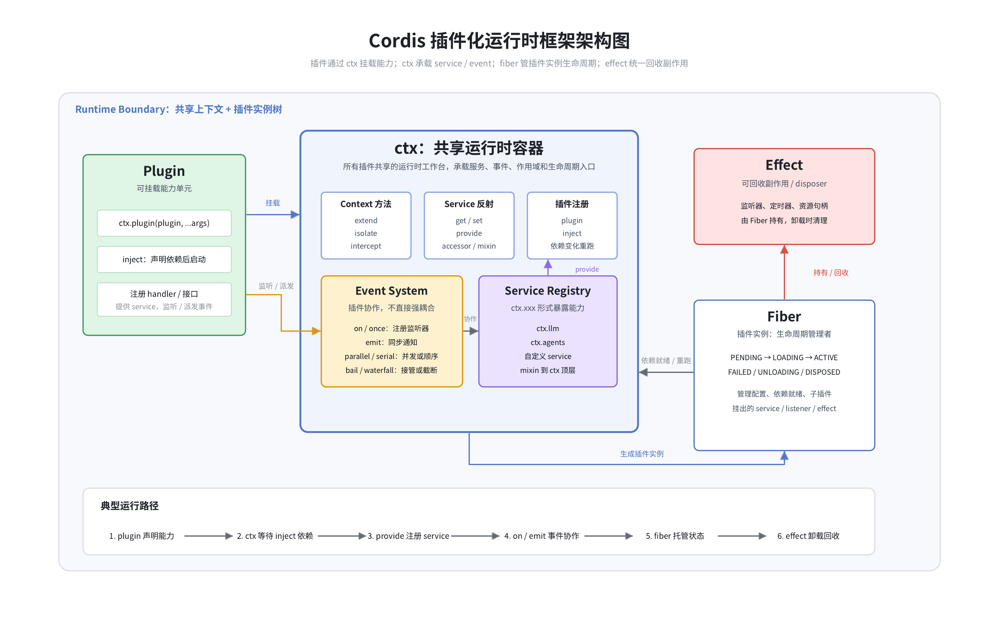

# Cordis 插件运行时

在真正理解 DSH 的框架和特性之前，需要先理解一下 Cordis。

Cordis 是一个“**插件化运行时框架**”。它把很多独立能力组织成一个可组合、可替换、可卸载的系统。具体来说，可以先记住四个关键词：

- **插件 Plugin**：功能不是写死在核心里，而是一个个插件挂进去；
- **上下文 Context**：插件共享的运行时容器，Service 都注册在这里；
- **事件 Event**：插件之间很多时候不是直接互相调用，而是通过事件协作；
- **生命周期 Effect**：插件挂载时注册能力，卸载时自动回收。

<figure class="article-figure article-figure--wide">
  <a href="./images/deepseek-harness-architecture.png" target="_blank" rel="noreferrer">
    
  </a>
  <figcaption>Plugin 通过 ctx 挂载能力；Service 提供稳定契约，Event 提供扩展位置，Fiber 与 Effect 管理能力的生命周期。</figcaption>
</figure>

## 1. 插件 Plugin

插件是系统里一个可以挂载的能力单元。本质上，它会把一批 Handler 和接口注册到 Context 上，并且可以按照统一的生命周期介入系统。

一个插件通常会做三件事：

1. 往 `ctx` 上挂一个 Service，比如 `ctx.llm`、`ctx.agents`；
2. 监听或派发事件；
3. 注册一些 Effect，在插件卸载时自动回收。

插件还可以声明自己依赖哪些 Service。只有这些依赖准备好以后，插件才会真正注册进去，这里使用的是 `inject`。

所以 Plugin 不是简单地“把一个函数执行一下”，而是：

```text
声明依赖
→ 等待依赖就绪
→ 注册 Service / Event / Effect
→ 参与系统运行
→ 卸载时统一清理
```

## 2. 上下文 Context

Context，也就是 `ctx`，是插件共享的运行时容器，可以理解为一个运行时工作台。

一个插件挂载之后，通常会做两类事情。

### 2.1 往 Context 中注册能力

- 注册 Service；
- 注册事件监听；
- 注册 Effect；
- 继续挂载子插件。

### 2.2 从 Context 中使用其他能力

- 调用其他插件注册的 Service；
- 监听其他模块派发的事件；
- 基于已有能力继续扩展新能力。

除了让插件注册能力之外，Context 自身也提供了一些运行时能力。这里不用逐个背 API，先按用途理解就可以。

### 2.3 派生和隔离 Context

| 能力 | 是做什么的 | 可以怎么理解 |
| --- | --- | --- |
| `ctx.extend(...)` | 从当前 Context 派生一个子 Context | 复制一个子作用域出来 |
| `ctx.isolate(...)` | 给某个 Service 建立独立解析范围 | 同名能力分仓，不与父作用域混用 |
| `ctx.intercept(...)` | 修改下面插件使用某个 Service 时的配置 | 在一棵插件子树里调整能力配置 |

这几个能力对 DSH 很重要，因为不同 Agent 不一定要看到完全相同的工具和配置。Context 可以从全局运行时继续往下派生，形成 Agent 自己的能力范围。

```text
Root Context
├── Agent A Context：工具集 A、提示词 A
└── Agent B Context：工具集 B、提示词 B
```

### 2.4 注册和取得 Service

| 能力 | 是做什么的 | 常见用途 |
| --- | --- | --- |
| `ctx.get(...)` | 读取一个 Service | 临时探测某项能力是否存在 |
| `ctx.provide(...)` | 向 Context 注册一个 Service | 让其他插件通过 `ctx.xxx` 使用 |
| `ctx.set(...)` | 更新当前插件提供的 Service | 修改自己注册出去的能力 |
| `ctx.mixin(...)` | 把 Service 的方法转发到 Context 顶层 | 让常用能力调用起来更直接 |

Service 在这里解决的是：**插件之间通过什么稳定接口合作。**

比如 Agent Loop 使用 `ctx.llm`，它依赖的是 LLM Service 对外提供的能力，而不是某个具体模型插件的内部实现。只要接口语义不变，底层 Provider 就可以替换。

### 2.5 挂载插件和声明依赖

| 能力 | 是做什么的 | 可以怎么理解 |
| --- | --- | --- |
| `ctx.plugin(...)` | 在当前 Context 中加载插件 | 挂载一个功能模块 |
| `ctx.inject(...)` | 等依赖 Service 就绪后再运行 | 声明依赖之后再启动 |

这一点的价值是，插件不需要自己猜加载顺序。它只需要说“我依赖 LLM 和 Session”，Cordis 会在这些能力可用时启动它；依赖失效时，也能进入对应的生命周期处理。

## 3. 事件 Event

事件是插件之间协作的机制。一个插件说“某件事正在发生”，其他插件可以监听、参与、拦截，甚至改写结果。

### 3.1 事件在解决什么问题

如果没有事件，插件之间通常只能直接调用彼此：

- A 插件 Import B 插件；
- A 直接调用 B 的方法。

这样耦合会很重。有了事件以后，系统可以变成：

- 某处派发一个事件；
- 谁关心，谁来监听；
- 监听者不需要被派发方显式引用。

这样做的好处是：

- 降低插件之间的直接依赖；
- 更容易加入扩展逻辑；
- 更容易实现策略、拦截、审计、日志和权限控制。

### 3.2 监听器怎么注册

通常是某个插件启动时，调用 `ctx.on(...)` 把一个回调挂到事件名下面。

这一步做的事情，本质上是：

1. 指定一个事件名，比如 `agent/pre-step`；
2. 提供一个 Callback 或 Handler；
3. Cordis 把它记录到“事件名 → 监听器列表”中；
4. 同时把监听器的生命周期绑定到当前插件的 Fiber 上。

所以它不是随便往全局塞一个回调，而是某个插件在自己存活期间声明：“这个事件发生时，我想参与。”

插件卸载时，这些监听器也会被自动清掉，不需要另外手动维护。

### 3.3 事件怎么产生

事件通常由业务流程主动派发。比如 Agent Loop 运行到一个关键点时，调用：

- `emit`；
- `parallel`；
- `serial`；
- `bail`；
- `waterfall`。

它们不只是不同的方法名，而是代表不同的调度语义。

| 调度方式 | 语义 | 可以怎么理解 |
| --- | --- | --- |
| `emit` | 同步通知，不关心返回值 | 告诉大家某件事发生了 |
| `parallel` | 并发执行并等待所有监听器 | 大家同时处理 |
| `serial` | 按顺序等待监听器 | 一个个询问 |
| `bail` | 谁先给出有效结果，谁接管 | 同步抢答 |
| `waterfall` | 形成中间件链，可以包裹或截断后续流程 | 一层层参与处理 |

### 3.4 事件怎么派发

这里最关键的一步，是 Cordis 在内存中维护了一张按照 Event Type 组织的 Map。可以把它理解为：

```text
event type
    ↓
对应的 handler 列表
```

插件调用 `ctx.on(...)` 注册监听器时，Cordis 会根据事件类型，把这个 Handler 挂到对应的列表里。比如某个插件监听 `agent/pre-step`，内存中就会形成类似这样的关系：

```text
"agent/pre-step" → [handlerA, handlerB, handlerC]
"tools/pre-execute" → [handlerD, handlerE]
"session/created" → [handlerF]
```

这张 Map 是事件派发能够找到监听器的基础。它不是每次事件发生时临时扫描所有插件，而是先通过 Event Type 定位到对应的 Handler 列表，再处理后面的 Scope 和调度逻辑。

派发时，Cordis 大致会做几件事：

1. 读取本次事件的 Event Type；
2. 通过内存 Map 找到这个 Event Type 对应的 Handler 列表；
3. 根据当前 Context 和 Scope 对 Handler 进行过滤；
4. 按照当前事件使用的调度方式执行剩下的监听器。

所以这里的“找到监听器”，实际并不是一句抽象描述，而是一次 Map 查找：先找到 `event type` 这一项，再取得挂在它下面的 Handler 集合。

#### 3.4.1 为什么还需要 Scope 过滤

Map 只能回答“哪些 Handler 声明过自己关注这个 Event Type”，但不能直接决定“这些 Handler 是否应该参与当前这次事件”。

第三步的过滤很重要：

- 有些监听器只在某个 Agent Scope 下有效；
- 有些监听器属于全局 Scope，不受单个 Agent 限制；
- Agent A 私有的监听器，不应该参与 Agent B 的事件。

也就是说，Event Type Map 负责第一次路由，Scope 负责第二次筛选。两步合起来，才能得到这次事件真正要执行的 Handler。

#### 3.4.2 找到 Handler 后怎么执行

找到并筛选出监听器以后，也不是永远用同一种方式执行：

- `emit` 就是通知一下；
- `parallel` 是大家并发处理；
- `serial` 是按顺序处理；
- `bail` 是谁先返回有效结果，谁接管；
- `waterfall` 会形成一条责任链，决定是否继续往下执行。

所以事件派发不只是“广播”，而是：**先通过内存 Map 按 Event Type 找到 Handler，再按 Scope 过滤，最后按这个事件约定的语义运行。**

### 3.5 监听到事件后可以做什么

监听器收到事件以后，通常有几种处理方式。

第一种是**纯观察**，比如记录日志、Telemetry 或审计信息。它只知道这件事发生了，不修改流程。

第二种是**补充或改写信息**，比如给 Request 增加一段上下文，或者修改工具执行后的结果。这时监听器是在参与流程。

第三种是**拦截或接管**，这在 `bail` 和 `waterfall` 中比较常见：

- `bail` 中，某个监听器先返回有效结果，后面的就不再执行；
- `waterfall` 中，监听器如果不继续调用下一层，整条链就会在这里停止。

所以监听器不一定只是“收到消息后执行一点逻辑”，它也可能：

- 修改输入；
- 修改输出；
- 决定是否继续；
- 直接替换系统默认行为。

::: tip 核心机制
这个监听器机制，本质上是在 Context 中维护一个“Event Type → Handler 列表”的内存 Map。插件注册监听器时，就把 Handler 挂到对应的 Event Type 下面；事件发生时，框架先通过 Map 找到这一类事件对应的 Handler，再根据 Scope 判断哪些 Handler 需要参与，最后按照既定的调度语义执行它们。
:::

## 4. 生命周期 Fiber 与 Effect

这里可以先记住两句话：

**Fiber 管插件实例的生命周期。**

**Effect 管这个插件实例创建出来的、需要清理的副作用和资源。**

### 4.1 Effect 在解决什么问题

如果在插件里做了一件会留下运行时痕迹的事情，比如：

- 启动一个 Timer；
- 注册一个 Listener；
- 持有一个连接；
- 创建一个 Terminal；
- 启动一个后台任务；

那么这件事最好作为 Effect 交给 Cordis 托管。插件卸载时，Cordis 才知道应该怎么把它撤掉。

Effect 可以理解为：**执行一段初始化逻辑，并且把对应的 Cleanup 一起注册给框架。**

```text
现在创建一个资源
→ 告诉框架以后怎样清理
→ 资源跟随插件实例存活
→ 插件卸载时执行清理
```

### 4.2 Plugin、Fiber 与 Context 的关系

- **Plugin**：插件的定义和代码；
- **Fiber**：插件被 `ctx.plugin(...)` 挂载后产生的运行时实例；
- **Context**：这个实例运行时所在的上下文和能力范围。

Fiber 主要管理：

- 当前生命周期状态，例如 Pending、Loading、Active、Failed、Unloading、Disposed；
- 插件配置；
- 依赖的 Service 是否就绪；
- 注册过的 Effect；
- 插件自己的清理逻辑；
- 它挂载的 Service、Listener 和子插件。

## 5. 为什么 Cordis 适合作为 DSH 的底座

在了解这些机制以后，就比较容易理解 Cordis 对 DSH 的价值了。

### 5.1 插件化装配

DSH 不是一个“写死功能的 Agent App”，而是一个 Agent Harness。它需要模型、工具、Session、Sandbox、Subagent、Terminal 等能力按场景自由组合。

用 Cordis 之后，这些能力都可以做成 Plugin，启动时再装起来。要增加新能力时，不需要继续修改一个越来越大的核心；要更换实现时，也不需要整套重写，而是替换对应插件。

### 5.2 Event / Hook 提供扩展点

`agent/pre-step`、`tools/pre-execute` 这类事件，本质上都是执行流里可以插手的位置。

权限控制、上下文注入、日志、Plan Mode、Skill 注入等逻辑都可以挂在事件上，而不是硬编码进 Agent Loop。这样核心流程可以保持稳定，周围继续增加策略和扩展。

### 5.3 Service 保持能力契约稳定

在 Agent Harness 中，很多能力都不应该只有一种实现，比如 LLM、Shell、File System、Subagent 和 Session Persistence。

DSH 让上层依赖 `ctx.llm`、`ctx.fs`、`ctx.subagents` 这些稳定的能力契约，而不是依赖某个插件内部怎么实现。只要参数、返回值和基本语义保持一致，底层 Provider 就可以替换，上层 Agent 编排逻辑不需要一起重写。

换句话说，它真正保证的不是“插件名字可以换”，而是**能力接口稳定、具体实现可替换**。

### 5.4 Fiber 与 Effect 统一回收资源

Agent 系统不是一次请求结束后就退出。它会长期持有 Listener、Timer、Terminal、Session Handle、子插件和连接等资源。

Cordis 不只让系统“可以扩展”，也让扩展出来的资源“最终可以收回来”。插件卸载时，Fiber 会把自己名下的 Effect 一起清理，从而减少资源泄漏、重复注册和状态残留。

### 5.5 Scope 隔离不同 Agent

Agent Harness 经常不是“全局一套能力走天下”。有的 Agent 可以调用某些工具，有的不能；有的 Session 有特定上下文，有的没有。

Context、Scope 和 Isolate 让 DSH 可以在同一个进程中，为不同 Agent 组装不同能力集合，并且尽量不互相污染。

### 5.6 Profile 与 Bundle 组合产品形态

DSH 既有 Web，也有 Headless、SDK 和 Host / Client 等入口。Profile 与 Bundle 让这些差异主要体现在“怎样装配插件”，而不是复制多套核心系统。

这说明 DSH 不是在做一个单用途程序，而是在做一个可以投影成多种产品形态的平台底座。

::: tip 章节小结
总的来说，我觉得 DSH 的好处，不是它单独把某一个 Agent 能力做得多复杂，而是它把 Agent Runtime 这件事平台化了。

很多 Agent 系统一开始只是“调用模型 + 调用工具”，后面加上 Session、Sandbox、Subagent、Hook、Terminal、权限控制和不同运行入口以后，代码很容易变得混乱。DSH 的做法是把这些能力拆成 Plugin 和 Service，再用统一的 Context、Event 和生命周期去编排。

所以如果用一句话总结：DSH 的优势不是只帮你“做一个 Agent”，而是帮你“搭一个能持续长大的 Agent 平台”。
:::
